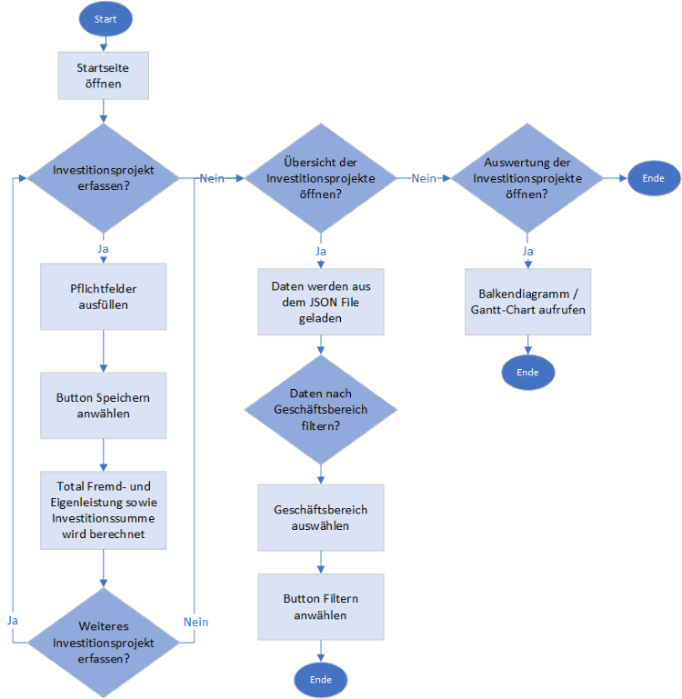

# Investitionsprojekte
## Inhalt
1. [Ausgangslage des Projektes](#ausgangslage-und-projektidee)
2. [Funktionen_und_Teilschritte](#funktionen-und-teilschritte)
3. [Ablaufdiagramm](#ablaufdiagramm)
4. [Betrieb](#betrieb)
5. [Erweiterungsmöglichkeiten](#erweiterungsmglichkeiten)

## Ausgangslage und Projektidee
Bei vielen Unternehmen sind die Angaben zu den Projekten nicht zentral verfügbar
und keine Auswertung liegt vor. 
Um einen Überblick und Analyse der Investitionsprojekte zu erhalten, soll mittels Eingabe in einem Formular die 
Informationen zu einem Investitionsprojekt erfasst werden.
Zudem sollen alle Investitionsprojekte in einer Tabelle mit Filterfunktion dargestellt werden
und in Form eines Balkendiagramms und eines Gantt-Charts ausgewertet werden. 

## Funktionen und Teilschritte
### Dateneingabe
Auf der Startseite kann ein neues Investitionsprojekt erfasst werden.
Ein Formular öffnet sich mit Feldern wie Vorname / Name des Antragstellers und Projektleiters, Geschäftsfeld, 
Titel des Projektes, Priorität, Terminplan, externe Kosten und interne Kosten.

### Datenverarbeitung
###### **Speicherung und Ausgabe:**
Mittels der Funktion in Python (daten.py) werden die Input Felder als Parameter übergeben und in der Json-Datei 
(ausgabe_dict.json)gespeichert. 

###### **Berechnung der Werte:**
Aufgrund der Angaben aus dem Formular werden folgende Werte berechnet: 
- Total Fremdleistungen (Summe Cash-Out 1 -4. Quartal)
- Total Eigenleistungen (Summe aller Anzahl Stunden pro Abteilung multipliziert mit dem Stundensatz 55.50)
- Total Investitionssumme (Summe von Fremd- und Eigenleistungen)

### Analyse
Die Analyse umfasst die Tabelle und die Grafische-Auswertung.
- Übersicht (Tabelle) aller laufenden Investitionsprojekte mit Filterfunktion 
- Balkendiagramm der Investitionssummen pro Geschäftsfeld 
- Gantt-Chart mit Dauer der einzelnen Projekte (Start- und Enddatum)

## Ablaufdiagramm

## Betrieb

## Erweiterungsmöglichkeiten
###### **Währung Euro**
Bei international tätigen Unternehmen ist es erfoderlich die Kosten in CHF als auch in EURO anzugeben.
Die Umrechnung der Währung sollte automatisch im Formular integriert sein.

###### **Erweiterung interne Abteilungen**
Eine zusätzliche Erweiterung wäre, die internen Abteilungen miteinzubezihen.

Mögliche Use Cases: 
- Geschäftsleitung kann ein Projekt freigeben oder ablehnen. Wird es abgelehnt muss eine Begründung eingegeben werden, der Status wechselt auf "abgelehnt" und der Antragsteller erhält eine E-Mail. 
- Die Buchhaltung trägt die effektiv angefallenen Kosten ein. Daraus wird berechnet ob das Projekt im Budget liegt. Ist dem nicht so, erscheinen diese Projekte rot in den Grafiken. 
